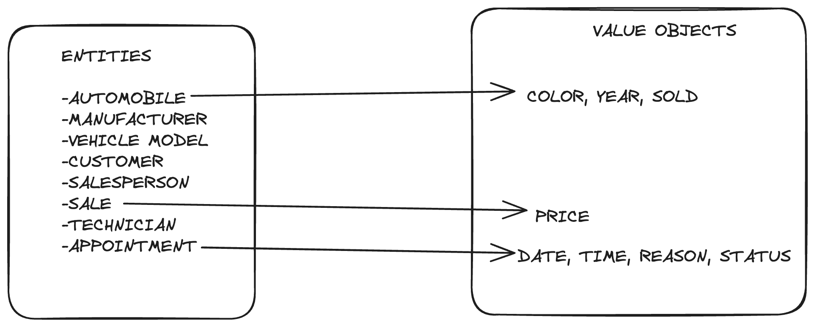

# CarCar

Team:

- Onkur - Which microservice? Sales
- Micheal - Which microservice? Service

## How to use this application

- Clone this repo
  - `git clone https://gitlab.com/Onkurlal/project-beta`
- Navigate to project-beta
  - `cd project-beta`
- Make sure [Docker](https://www.docker.com/get-started/) is installed on your machine
- Create the volume
  - `docker volume create beta-data`
- Build docker images
  - `docker-compose build`
- Build docker containers from images
  - `docker-compose up`
- Access the frontend React app on `http://localhost:3000`

## Design

The following diagram shows the architecture of the CarCar application. The application consists of three microservices including inventory, sales, and service. The sales and service microservices poll inventory for the list auomobiles.

## Inventory microservice

With in the inventory microservice there will be three models including Manufacturer, VehicleModel, and Automobile. The model for the Manufacturer will include a name field. The VehicleModel model will include the following fields: name, picture_url, and manufactuer_id(ForeignKey). The Automobile model will include the following fields: color, year, vin, and model(ForeignKey).

The automobile api will have the following routes:

- `http://localhost:8100/api/manufacturers/` This route is used to get the list of all manufacturers using a `GET` request and create a new manufacturer using a `POST` request.
- `http://localhost:8100/api/manufacturers/:id/` This route is used to delete a specific manufacturer using a `DELETE` request, edit a manufacturer using a `POST` request, and get details on a specific manufacturer using a `GET` request.
- `http://localhost:8100/api/models/` This route is used to get the list of all vehicle models using a `GET` request and create a new vehicle model using a `POST` request.
- `http://localhost:8100/api/models/:id/` This route is used to delete a specific vehicle model using a `DELETE` request, edit a vehicle model using a `POST` request, and get details on a specific vehicle model using a `GET` request.
- `http://localhost:8100/api/automobiles/` This route is used to get the list of all automobiles using a `GET` request and create a new automobile using a `POST` request.
- `http://localhost:8100/api/manufacturers/:vin/` This route is used to delete a specific automobile using a `DELETE` request, edit an automobile using a `POST` request, and get details on a specific automobile using a `GET` request.

## Service microservice

The Service microservices will have three models. Those three models are Technician,AutomobileVO, and an Appointment model. The Technician model will have the following fields: First name, Last name, and their employee ID. The AutomobileVO will have the Vin number and the Sold fields. Last is the Appointment model which will have the date_time, reason, status,vin number, and technician fields. The only two foreign keys that will be in this microservice will be the Technician field, and the AutomobileVO.

The services will have the following routes:

- `http://localhost:8080/api/technicians/` - 'GET' request to get a list of all the technicians and 'POST' request to create a new technician.
- `http://localhost:8080/api/technicians/` - 'DELETE' request to delete a specific technician.
- `http://localhost:8080/api/appointments/` - 'GET' request to get a list of all the appointments and 'POST' request to create a new appointment.
- `http://localhost:8080/api/appointments/` - 'DELETE' request to delete a specific appointment.
- `http://localhost:8080/api/appointments/:id/cancel/`- uses a 'PUT' to set appointment status to cancelled.
- `http://localhost:8080/api/appointments/:id/finish/`- uses a 'PUT' to set appointment status to finished.

## Sales microservice

With in the sales microservice there will be four models including Salesperson, Customer, Sale, and Sale. The model for the Salesperson will include the following fields: first_name, last_name, employee_id. The Customer model will include the following fields: first_name, last_name, address, and phone_number. The Sale model will include the following fields: automobile, salesperson, customer and price. All of the fields will be a foreign key on this model except the price field. The AutomobileVO model will have vin and sold (booloean) as fields. The Sales microservice will be polling the Inventory service to get the a list of automobiles every 60 seconds.

Also in the Sales microservice there will be the poller. In the poller there will be an automobileVO model as well. The poller will reach out to the inventory api at `http://project-beta-inventory-api-1:8000/api/automobiles/` to get the current list of automobiles. Each of the automobiles will then have an instance created in the sales api.

The sales api will have the following routes:

- `http://localhost:8090/api/salespeople/` This route is used to get the list of all salespeople using a `GET` request and create a new sales person using a `POST` request.
- `http://localhost:8090/api/salespeople/:id/` This route is used to delete a specific salesperson using a `DELETE` request.
- `http://localhost:8090/api/customers/` This route is used to get the list of all customers using a `GET` request and create a new customer using a `POST` request.
- `http://localhost:8090/api/customers/:id/` This route is used to delete a specific customer using a `DELETE` request.
- `http://localhost:8090/api/sales/` This route is used to get the list of all sales using a `GET` request and create a new sale using a `POST` request.
- `http://localhost:8090/api/sales/:id/` This route is used to delete a specific sale using a `DELETE` request.
